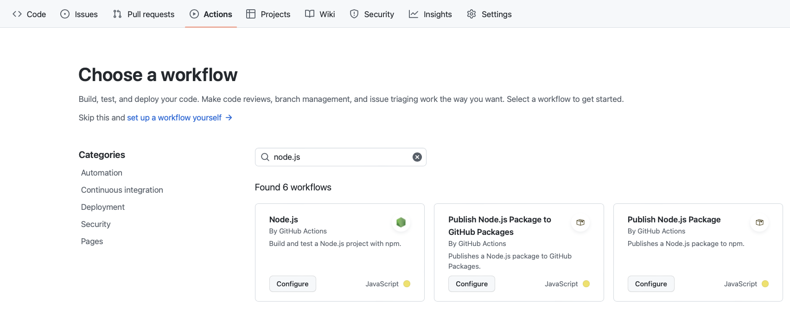
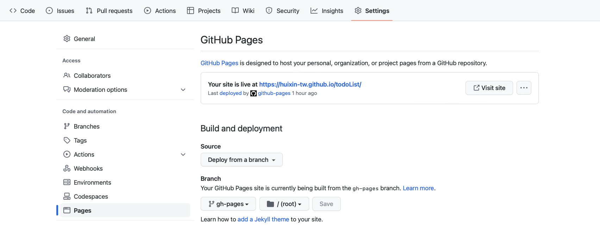

# A glance at my work

[Visit my todo page.](https://huixin-tw.github.io/todoList/)

# Getting Started with Create React App

This project was bootstrapped with [Create React App](https://github.com/facebook/create-react-app).

# 1st thing to do after cloning to your computer

## NPM (node package manager) method

Run `npm -v` to ensure npm (node package manager) is installed.

Run `npm install` to install all packages.

## Yarn method (alternative to using NPM)

Run `yarn -v` to ensure yarn is installed (alternative to npm).

Run `yarn` to install all packages.

## Available Scripts

In the project directory, you can run:

### `yarn dev` OR `npm run dev`

Runs the app in the development mode.\
Open [http://localhost:3000](http://localhost:3000) to view it in the browser.

The page will reload if you make edits.\
You will also see any lint errors in the console.

**There are some other scripts but, to be honest, they don't matter at this point.** (this will be covered in the package manager workshop)

## Learn More

You can learn more in the [Create React App documentation](https://facebook.github.io/create-react-app/docs/getting-started).

To learn React, check out the [React documentation](https://reactjs.org/).

### Code Splitting

This section has moved here: [https://facebook.github.io/create-react-app/docs/code-splitting](https://facebook.github.io/create-react-app/docs/code-splitting)

# Deploying React + Vite app

If you are using a framework template, all you need to do is open `vite.config.js`

```
import { defineConfig } from 'vite'
import react from '@vitejs/plugin-react'

// https://vitejs.dev/config/
export default defineConfig({
  plugins: [react()],
  base: "./"
})
```

Navigate to the 'Actions' tab on your GitHub repository.


- Change `node-version` to your version
- Remove `run: npm test`
- Add the below codes

```
- name: Deploy
      uses: peaceiris/actions-gh-pages@v3
      with:
        github_token: ${{ secrets.GITHUB_TOKEN }}
        publish_dir: ./dist
```

Then, commit new file

Navigate to the 'Setting' tab on your GitHub repository.
